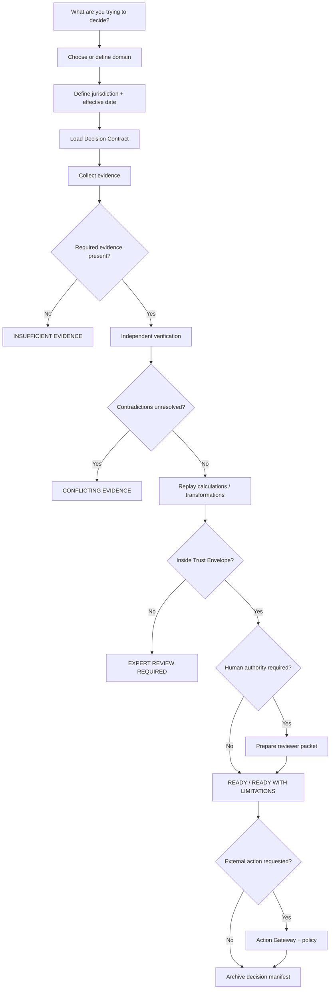

# Generic User Decision Tree

```mermaid
flowchart TD
    A[What are you trying to decide?] --> B[Choose or define domain]
    B --> C[Define jurisdiction + effective date]
    C --> D[Load Decision Contract]
    D --> E[Collect evidence]
    E --> F{Required evidence present?}
    F -->|No| G[INSUFFICIENT EVIDENCE]
    F -->|Yes| H[Independent verification]
    H --> I{Contradictions unresolved?}
    I -->|Yes| J[CONFLICTING EVIDENCE]
    I -->|No| K[Replay calculations / transformations]
    K --> L{Inside Trust Envelope?}
    L -->|No| M[EXPERT REVIEW REQUIRED]
    L -->|Yes| N{Human authority required?}
    N -->|Yes| O[Prepare reviewer packet]
    N -->|No| P[READY / READY WITH LIMITATIONS]
    O --> P
    P --> Q{External action requested?}
    Q -->|Yes| R[Action Gateway + policy]
    Q -->|No| S[Archive decision manifest]
    R --> S
```
