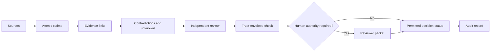

# Public Architecture

This repository is intentionally a methodology layer, not a production decision engine.

## Anti-hallucination and anti-drift design

- **Atomic claims:** a document is not treated as one block of truth.
- **Source lineage:** material claims point back to evidence.
- **Contradictions stay visible:** disagreement is not averaged into false certainty.
- **Bounded statuses:** outputs use named readiness states rather than invented confidence scores.
- **Authority is explicit:** the machine cannot silently grant itself decision power.
- **Synthetic public data:** the demonstration cannot be mistaken for a real case.
- **Fail-closed file inventory:** unclassified public files are rejected.
- **Deterministic checks:** schema, demo, and boundary rules run without an AI model or network access.

## What is implemented here

- a static, zero-runtime-dependency educational interface;
- a generic JSON Schema for evidence claims;
- a synthetic example case;
- methodology and decision-tree documentation;
- automated public-boundary and consistency checks.

## What is not implemented here

This public repository does not retrieve evidence, call models, calculate real decision outcomes, perform external actions, monitor authoritative sources, or replace professional judgment. Those capabilities must not be inferred from the interface.
